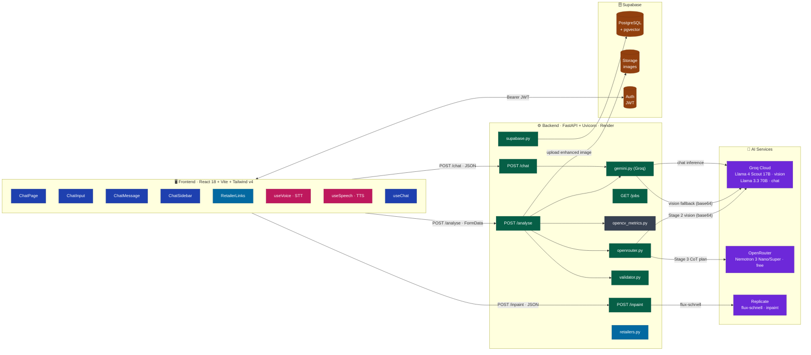
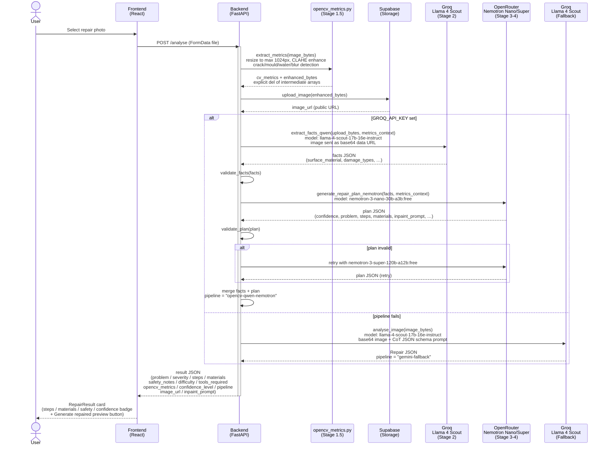
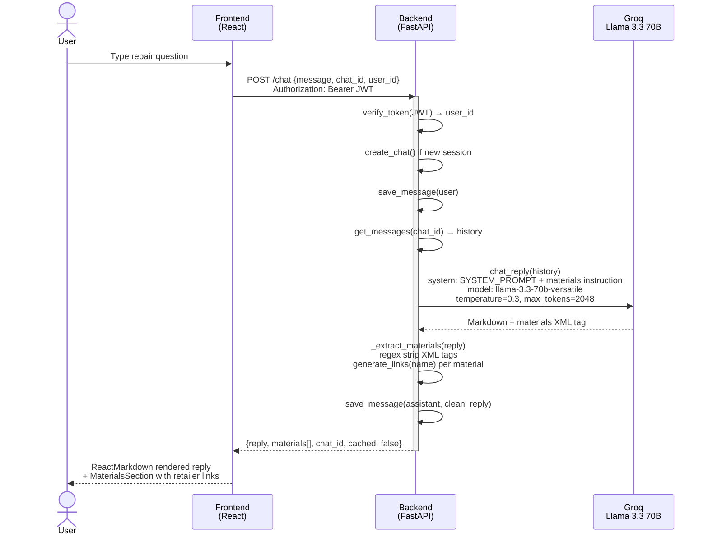
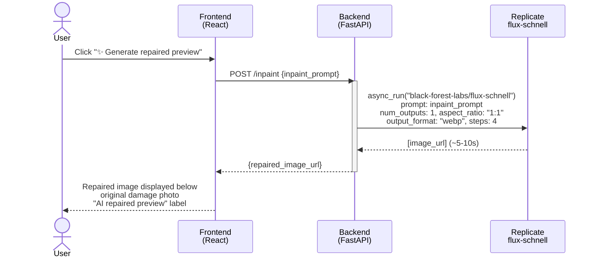
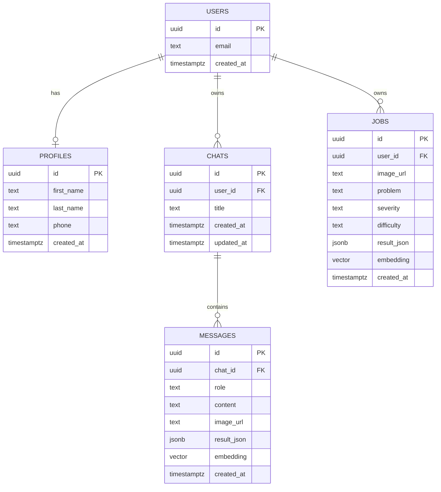
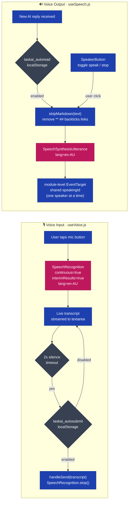
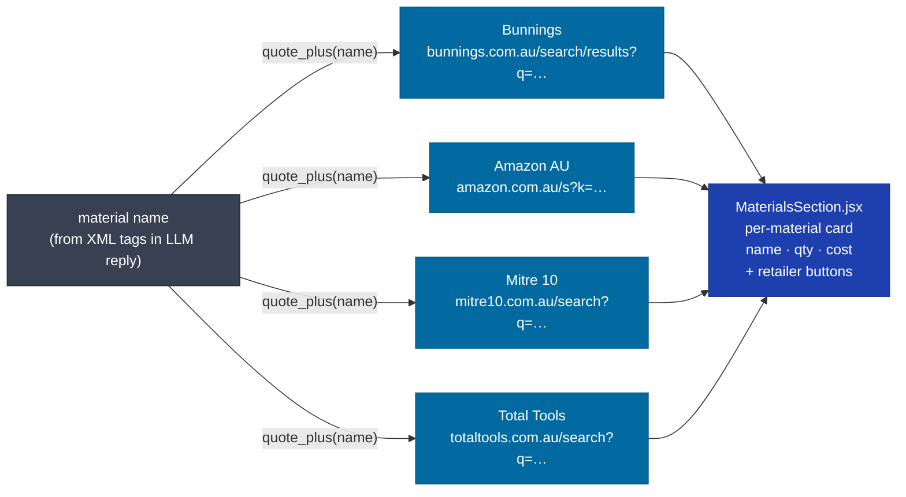
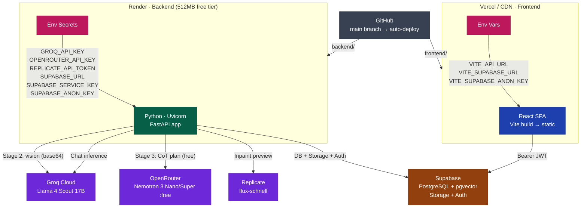

# task.ai — System Architecture

> AI-Powered Home Repair Assistant for Australian Homeowners
> **Version** 1.2 · **Last updated** May 2026

---

## Table of Contents

1. [High-Level System Architecture](#1-high-level-system-architecture)
2. [AI & LLM Inference Architecture](#2-ai--llm-inference-architecture)
3. [Vision Pathway — Image Analysis](#3-vision-pathway--image-analysis)
4. [Text Chat Pathway](#4-text-chat-pathway)
5. [Inpaint Repaired Preview](#5-inpaint-repaired-preview)
6. [Database Schema](#6-database-schema)
7. [Voice I/O Pipeline](#7-voice-io-pipeline)
8. [Retailer Link Generation](#8-retailer-link-generation)
9. [Deployment Architecture](#9-deployment-architecture)
10. [Technology Stack](#10-technology-stack)

---

## 1. High-Level System Architecture

---

## 2. AI & LLM Inference Architecture

All inference runs on **Groq** (free) and **OpenRouter** (Nemotron free tier). Google Gemini is not used.

```mermaid
flowchart TD
    classDef model   fill:#6D28D9,stroke:#5B21B6,color:#fff
    classDef engine  fill:#1E40AF,stroke:#1E3A8A,color:#fff
    classDef sdk     fill:#065F46,stroke:#064E3B,color:#fff
    classDef output  fill:#92400E,stroke:#78350F,color:#fff
    classDef task    fill:#374151,stroke:#1F2937,color:#fff

    subgraph GROQ_VIS["Groq · Vision Facts (Stage 2)"]
        M1["Llama 4 Scout 17B-16E<br/>(MoE Instruct)"]:::model
        T1["Task: Visual fact extraction<br/>Base64 image — no URL fetch<br/>Objective observations only"]:::task
        SDK1["groq Python SDK<br/>chat.completions.create()"]:::sdk
        OUT1["Output: Structured JSON<br/>surface_material / damage_types<br/>moisture_visible / grout_condition"]:::output
        M1 --> T1 --> SDK1 --> OUT1
    end

    subgraph OR_PLAN["OpenRouter · CoT Repair Plan (Stage 3 + 4)"]
        M2["Nemotron 3 Nano 30B :free<br/>(primary)"]:::model
        M2S["Nemotron 3 Super 120B :free<br/>(retry on validation fail)"]:::model
        T2["Task: Chain-of-thought<br/>repair reasoning"]:::task
        SDK2["httpx.AsyncClient<br/>OpenAI-compatible REST<br/>openrouter.ai/api/v1"]:::sdk
        OUT2["Output: Structured JSON<br/>confidence / problem / severity<br/>steps / materials / tools<br/>root_cause / inpaint_prompt"]:::output
        M2 --> T2
        M2S --> T2
        T2 --> SDK2 --> OUT2
    end

    subgraph GROQ_CHAT["Groq · Text Chat"]
        M3["Llama 3.3 70B Versatile"]:::model
        T3["Task: Multi-turn repair advice<br/>temperature=0.3"]:::task
        SDK3["groq Python SDK<br/>chat.completions.create()"]:::sdk
        OUT3["Output: Markdown +<br/>embedded XML materials tag"]:::output
        M3 --> T3 --> SDK3 --> OUT3
    end

    subgraph GROQ_FB["Groq · Vision Fallback"]
        M4["Llama 4 Scout 17B-16E"]:::model
        T4["Task: Direct vision → JSON<br/>Used when Stage 2-3 pipeline fails"]:::task
        SDK4["groq Python SDK<br/>chat.completions.create()"]:::sdk
        OUT4["Output: Structured JSON<br/>problem / steps / materials<br/>safety_notes / severity"]:::output
        M4 --> T4 --> SDK4 --> OUT4
    end

    subgraph REPLICATE["Replicate · Inpaint Preview"]
        M5["flux-schnell<br/>black-forest-labs"]:::model
        T5["Task: Text-to-image<br/>photorealistic repaired surface"]:::task
        SDK5["replicate Python SDK<br/>async_run()"]:::sdk
        OUT5["Output: WebP image URL<br/>1:1 aspect, 4 steps"]:::output
        M5 --> T5 --> SDK5 --> OUT5
    end
```

### Model Summary

| | Llama 4 Scout (Stage 2) | Nemotron Nano/Super (Stage 3/4) | Llama 3.3 70B (Chat) | Llama 4 Scout (Fallback) | flux-schnell (Inpaint) |
|---|---|---|---|---|---|
| **Provider** | Groq | OpenRouter | Groq | Groq | Replicate |
| **Role** | Vision fact extraction | CoT repair plan | Text chat | Pipeline fallback | Repaired preview |
| **Input** | Base64 image + metrics | JSON facts + metrics | Multi-turn messages | Base64 image | Text prompt |
| **Output** | Facts JSON | Plan JSON | Markdown + XML | Repair JSON | WebP image URL |
| **Cost** | Free | Free (`:free` models) | Free | Free | Pay per run |

---

## 3. Vision Pathway — Image Analysis

---

## 4. Text Chat Pathway

RAG embeddings are currently disabled (stubbed). Chat calls Groq directly on every message.

---

## 5. Inpaint Repaired Preview

Triggered on demand by the "Generate repaired preview" button on each repair result card. Uses the `inpaint_prompt` field returned by Nemotron.

---

## 6. Database Schema

> **pgvector config:**
>
> `messages.embedding vector(3072)` — reserved for future RAG (currently null, embeddings disabled)
> `jobs.embedding vector(768)` — reserved for future job similarity (currently null)
>
> RLS: users access only their own rows in `chats`, `messages`, `jobs`, `profiles`
> Auto-trigger: `handle_new_user()` creates a `profiles` row on every new auth signup

---

## 7. Voice I/O Pipeline

---

## 8. Retailer Link Generation

---

## 9. Deployment Architecture

---

## 10. Technology Stack

| Layer | Technology | Notes |
|---|---|---|
| **Frontend framework** | React 18 | SPA, hooks-based |
| **Build tool** | Vite 5.4 | HMR, tree-shaking |
| **Styling** | Tailwind CSS v4 | No `tailwind.config.js` — `@plugin` in CSS |
| **Markdown** | react-markdown + remark-gfm | GFM tables, code blocks |
| **Auth client** | @supabase/supabase-js 2.x | JWT session management |
| **Backend** | FastAPI + Uvicorn | Async, Pydantic v2 |
| **Vision Stage 2** | Llama 4 Scout 17B-16E (Groq) | Base64 image input, visual fact extraction |
| **Vision Stage 3** | Nemotron 3 Nano 30B (OpenRouter :free) | CoT repair reasoning, JSON output |
| **Vision Stage 4** | Nemotron 3 Super 120B (OpenRouter :free) | Retry model on validation failure |
| **Vision Fallback** | Llama 4 Scout 17B-16E (Groq) | Direct image → JSON if pipeline fails |
| **LLM — chat** | Llama 3.3 70B Versatile (Groq) | Multi-turn, temperature=0.3 |
| **LLM — embeddings** | Disabled | Stubbed; reserved for future RAG re-enable |
| **Inpaint preview** | flux-schnell (Replicate) | Text-to-image, WebP, 4 steps, ~5-10s |
| **Image pre-processing** | OpenCV headless + numpy | CLAHE, crack/mould/water/blur detection; resize to 1024px max |
| **Image loading** | Pillow | Byte decoding |
| **Database** | Supabase (PostgreSQL 15) | Managed Postgres |
| **Vector search** | pgvector · IVFFlat | Reserved; cosine similarity |
| **File storage** | Supabase Storage | `repair-photos` bucket, enhanced images |
| **Voice STT** | Web Speech API | en-AU, 2s silence auto-submit |
| **Voice TTS** | Web Speech API | Shared emitter, markdown stripped |
| **Retailer links** | URL template generation | Bunnings / Amazon AU / Mitre 10 / Total Tools |
| **Deployment — backend** | Render (512MB free tier) | Auto-deploy from GitHub main |
| **Deployment — frontend** | Vercel / Static CDN | Vite build → static assets |

---

*Last updated May 2026 · task.ai v1.2*
