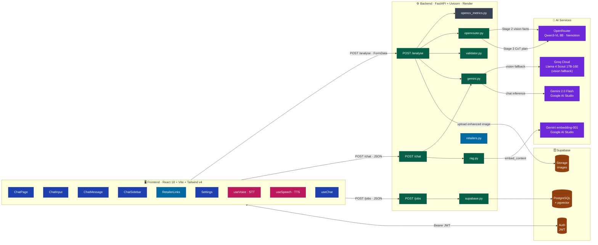
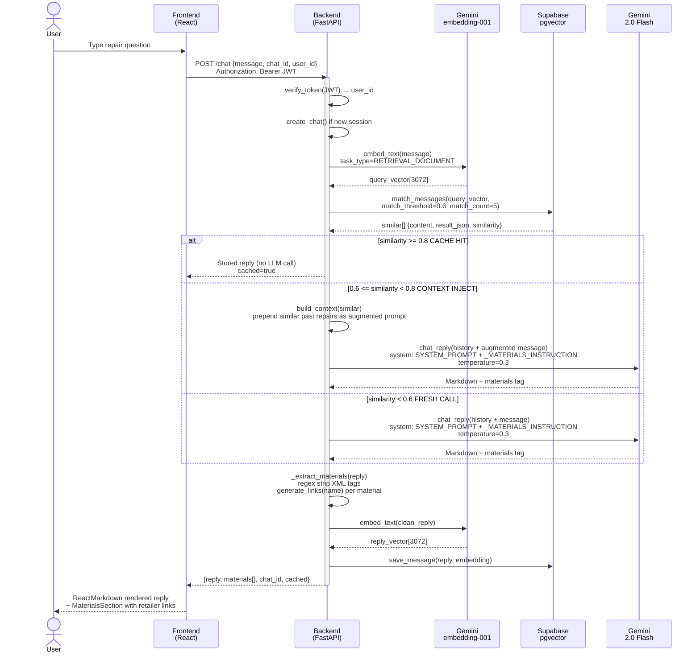
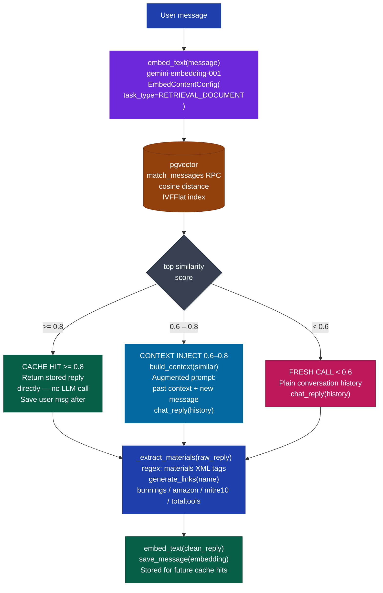
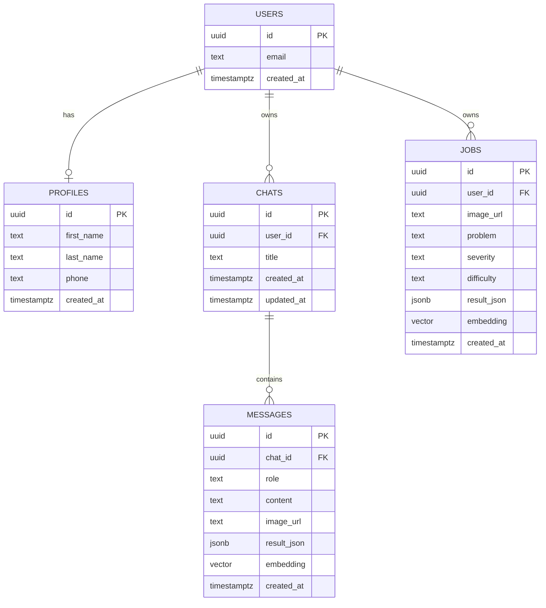
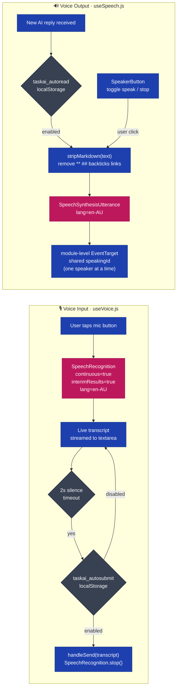
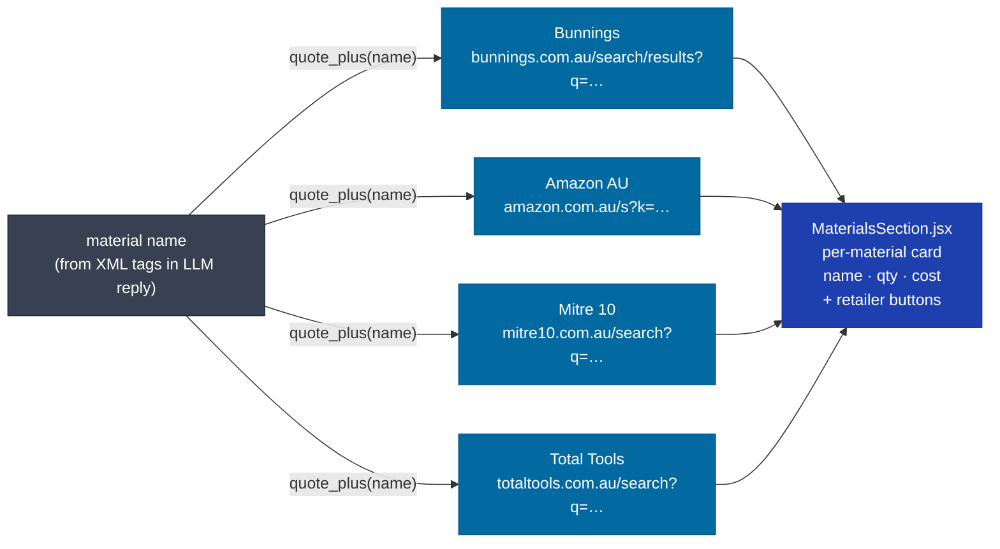
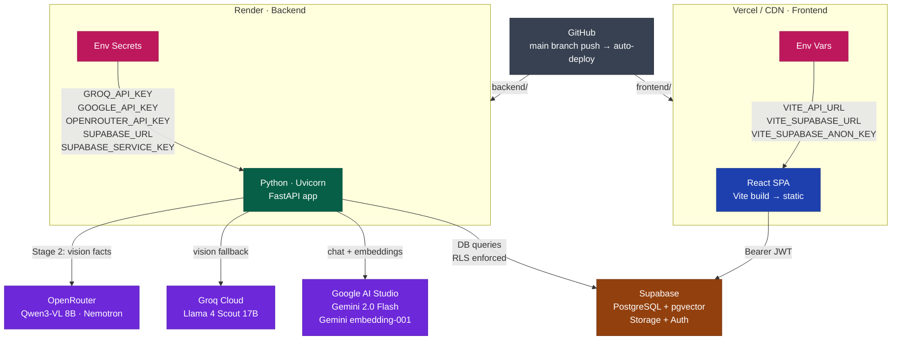

# task.ai — System Architecture

> AI-Powered Home Repair Assistant for Australian Homeowners
> **Version** 1.1 · **Last updated** May 2026

---

## Table of Contents

1. [High-Level System Architecture](#1-high-level-system-architecture)
2. [AI & LLM Inference Architecture](#2-ai--llm-inference-architecture)
3. [Vision Pathway — Image Analysis](#3-vision-pathway--image-analysis)
4. [Text Chat + RAG Pathway](#4-text-chat--rag-pathway)
5. [RAG Pipeline Detail](#5-rag-pipeline-detail)
6. [Database Schema](#6-database-schema)
7. [Voice I/O Pipeline](#7-voice-io-pipeline)
8. [Retailer Link Generation](#8-retailer-link-generation)
9. [Deployment Architecture](#9-deployment-architecture)
10. [Technology Stack](#10-technology-stack)

---

## 1. High-Level System Architecture



---

## 2. AI & LLM Inference Architecture

Four models serve distinct roles across two providers:

```mermaid
flowchart TD
    classDef model   fill:#6D28D9,stroke:#5B21B6,color:#fff
    classDef engine  fill:#1E40AF,stroke:#1E3A8A,color:#fff
    classDef sdk     fill:#065F46,stroke:#064E3B,color:#fff
    classDef output  fill:#92400E,stroke:#78350F,color:#fff
    classDef task    fill:#374151,stroke:#1F2937,color:#fff

    subgraph OR_VIS["OpenRouter · Vision Facts (Stage 2)"]
        M1["Qwen3-VL 8B Instruct"]:::model
        T1["Task: Visual fact extraction<br/>No diagnosis — objective observations only"]:::task
        SDK1["httpx.AsyncClient<br/>OpenAI-compatible REST<br/>openrouter.ai/api/v1"]:::sdk
        OUT1["Output: Structured JSON<br/>surface_material / damage_types<br/>moisture_visible / grout_condition"]:::output
        M1 --> T1 --> SDK1 --> OUT1
    end

    subgraph OR_PLAN["OpenRouter · CoT Repair Plan (Stage 3 + 4)"]
        M2["Nemotron 3 Nano 30B<br/>(primary)"]:::model
        M2S["Nemotron 3 Super 120B<br/>(retry on validation fail)"]:::model
        T2["Task: Chain-of-thought<br/>repair reasoning"]:::task
        SDK2["httpx.AsyncClient<br/>OpenAI-compatible REST<br/>openrouter.ai/api/v1"]:::sdk
        OUT2["Output: Structured JSON<br/>confidence / problem / severity<br/>steps / materials / tools<br/>root_cause / is_structural"]:::output
        M2 --> T2
        M2S --> T2
        T2 --> SDK2 --> OUT2
    end

    subgraph GROQ_FB["Groq Cloud · Vision Fallback"]
        M3["Llama 4 Scout 17B-16E<br/>(MoE Instruct)"]:::model
        T3["Task: Direct vision → JSON<br/>Used when OpenRouter unavailable"]:::task
        SDK3["groq Python SDK<br/>chat.completions.create()"]:::sdk
        OUT3["Output: Structured JSON<br/>problem / steps / materials<br/>safety_notes / severity<br/>difficulty"]:::output
        M3 --> T3 --> SDK3 --> OUT3
    end

    subgraph GEMINI_CHAT["Google AI Studio · Text Chat"]
        M4["Gemini 2.0 Flash"]:::model
        T4["Task: Multi-turn repair advice<br/>temperature=0.3"]:::task
        SDK4["google-genai SDK<br/>models.generate_content()"]:::sdk
        OUT4["Output: Markdown +<br/>embedded XML<br/>materials tag"]:::output
        M4 --> T4 --> SDK4 --> OUT4
    end

    subgraph GEMINI_EMBED["Google AI Studio · Embeddings"]
        M5A["Gemini embedding-001<br/>(chat RAG — 3072-dim)"]:::model
        M5B["Gemini embedding-001<br/>(job similarity — 768-dim)"]:::model
        T5["Task: Semantic vector search<br/>task_type=RETRIEVAL_DOCUMENT"]:::task
        SDK5["google-genai SDK<br/>models.embed_content()"]:::sdk
        OUT5["Output: Float list<br/>cosine similarity via pgvector"]:::output
        M5A --> T5
        M5B --> T5
        T5 --> SDK5 --> OUT5
    end
```



### Model Comparison

| | Qwen3-VL 8B | Nemotron 3 Nano/Super | Llama 4 Scout 17B | Gemini 2.0 Flash | Gemini embedding-001 |
|---|---|---|---|---|---|
| **Provider** | OpenRouter | OpenRouter | Groq Cloud | Google AI Studio | Google AI Studio |
| **Role** | Stage 2 — vision facts | Stage 3/4 — CoT plan | Vision fallback | Text chat | RAG embeddings |
| **Task** | Extract visual observations | Repair reasoning | Vision → JSON | Multi-turn advice | Semantic search |
| **Input** | Image URL + metrics context | JSON facts + metrics | Base64 image | Multi-turn messages | Text string |
| **Output** | Facts JSON | Plan JSON | Repair JSON | Markdown + XML | Float vector |
| **SDK** | `httpx` (OpenAI-compat REST) | `httpx` (OpenAI-compat REST) | `groq` Python | `google-genai` | `google-genai` |
| **Call** | `POST /chat/completions` | `POST /chat/completions` | `chat.completions.create()` | `models.generate_content()` | `models.embed_content()` |
| **Config** | `temperature=0.1` | `temperature=0.1` | `max_tokens=2048` | `temperature=0.3` | `output_dimensionality=3072 / 768` |

---

## 3. Vision Pathway — Image Analysis

```mermaid
sequenceDiagram
    actor User
    participant FE as Frontend<br/>(React)
    participant BE as Backend<br/>(FastAPI)
    participant OCV as opencv_metrics.py<br/>(Stage 1.5)
    participant SB as Supabase<br/>(Storage)
    participant QW as OpenRouter<br/>Qwen3-VL 8B<br/>(Stage 2)
    participant NE as OpenRouter<br/>Nemotron Nano/Super<br/>(Stage 3-4)
    participant GR as Groq Cloud<br/>Llama 4 Scout 17B<br/>(Fallback)

    User->>FE: Select repair photo
    FE->>BE: POST /analyse (FormData file)
    activate BE

    BE->>OCV: extract_metrics(image_bytes)
    OCV-->>BE: cv_metrics + enhanced_image_bytes<br/>crack_ratio_pct / affected_area_pct<br/>mould_detected / water_stain_detected<br/>is_blurry / image_quality

    BE->>SB: upload_image(enhanced_bytes)
    SB-->>BE: image_url (public URL)

    alt OPENROUTER_API_KEY set
        BE->>QW: extract_facts_qwen(image_url, metrics_context)<br/>model: qwen3-vl-8b-instruct<br/>image injected via image_url field
        QW-->>BE: facts JSON<br/>(surface_material, damage_types, …)

        BE->>BE: validate_facts(facts)<br/>checks: surface_material, damage_visible, damage_types

        BE->>NE: generate_repair_plan_nemotron(facts, metrics_context)<br/>model: nemotron-3-nano-30b-a3b:free
        NE-->>BE: plan JSON<br/>(confidence, problem, steps, materials, …)

        BE->>BE: validate_plan(plan)<br/>checks: confidence, problem, severity, steps, materials, tools_required

        alt plan invalid
            BE->>NE: retry with nemotron-3-super-120b-a12b:free
            NE-->>BE: plan JSON (retry)
            BE->>BE: validate_plan(plan retry)
        end

        BE->>BE: merge facts + plan<br/>add opencv_metrics, confidence_level<br/>pipeline = "opencv-qwen-nemotron"
    else OpenRouter unavailable / key missing
        BE->>GR: analyse_image(image_bytes)<br/>model: meta-llama/llama-4-scout-17b-16e-instruct<br/>image: data:image/jpeg;base64,...<br/>prompt: _IMAGE_PROMPT (CoT + JSON schema)
        GR-->>BE: Raw JSON string (max 2048 tokens)<br/>retry once on JSONDecodeError
        BE->>BE: pipeline = "gemini-fallback"<br/>confidence = 70 (medium)
    end

    BE-->>FE: result JSON<br/>(problem / severity / steps / materials<br/>safety_notes / difficulty / tools_required<br/>opencv_metrics / confidence_level / pipeline<br/>image_url)
    deactivate BE

    FE-->>User: RepairResult card<br/>(steps / materials / safety / confidence badge)
```

---

## 4. Text Chat + RAG Pathway



---

## 5. RAG Pipeline Detail



---

## 6. Database Schema



> **pgvector config:**
>
> `messages.embedding vector(3072)` — Gemini embedding-001 chat RAG (full dimension)
> Index: `CREATE INDEX ON messages USING ivfflat (embedding vector_cosine_ops) WITH (lists=100)`
> RPC: `match_messages(query_embedding, match_threshold=0.6, match_count=5)` — searches `role='assistant'` rows only
>
> `jobs.embedding vector(768)` — Gemini embedding-001 job similarity (reduced dimension via `output_dimensionality=768`)
> Index: `CREATE INDEX ON jobs USING ivfflat (embedding vector_cosine_ops) WITH (lists=100)`
> RPC: `find_similar_jobs(job_id, match_count)` — SECURITY DEFINER (cross-user similarity)
>
> RLS: users access only their own rows in `chats`, `messages`, `jobs`, `profiles`
> Auto-trigger: `handle_new_user()` creates a `profiles` row on every new auth signup

---

## 7. Voice I/O Pipeline



---

## 8. Retailer Link Generation



---

## 9. Deployment Architecture



---

## 10. Technology Stack

| Layer | Technology | Version | Notes |
|---|---|---|---|
| **Frontend framework** | React | 18.3 | SPA, hooks-based |
| **Build tool** | Vite | 5.4 | HMR, tree-shaking |
| **Styling** | Tailwind CSS | v4 | No `tailwind.config.js` — `@plugin` in CSS |
| **Typography** | @tailwindcss/typography | 0.5 | Prose classes for markdown |
| **Markdown** | react-markdown + remark-gfm | 10.x / 4.x | GFM tables, code blocks |
| **Auth client** | @supabase/supabase-js | 2.45 | JWT session management |
| **Backend** | FastAPI | latest | Async, Pydantic v2 |
| **ASGI server** | Uvicorn | latest | Render cloud |
| **Vision Stage 2** | Qwen3-VL 8B Instruct (OpenRouter) | — | Multimodal visual fact extraction |
| **Vision Stage 3** | Nemotron 3 Nano 30B (OpenRouter) | free tier | CoT repair reasoning, JSON output |
| **Vision Stage 4** | Nemotron 3 Super 120B (OpenRouter) | free tier | Retry model on validation failure |
| **Vision Fallback** | Llama 4 Scout 17B-16E (Groq) | — | Direct image → JSON, used when OpenRouter unavailable |
| **LLM — chat** | Gemini 2.0 Flash | — | Multi-turn, temperature=0.3 |
| **LLM — embeddings (chat)** | Gemini embedding-001 | — | 3072-dim float vectors, RETRIEVAL_DOCUMENT |
| **LLM — embeddings (jobs)** | Gemini embedding-001 | — | 768-dim float vectors, output_dimensionality=768 |
| **Vision HTTP client** | OpenRouter API (httpx) | latest | OpenAI-compatible REST, `openrouter.ai/api/v1` |
| **AI SDK (Groq fallback)** | groq (Python) | latest | `Groq(api_key=…)` |
| **AI SDK (chat + embed)** | google-genai (Python) | latest | New SDK: `genai.Client()` |
| **Image pre-processing** | OpenCV (opencv-python-headless) | latest | CLAHE contrast, crack detection, mould/water HSV, blur |
| **Image loading** | Pillow | latest | Byte decoding via numpy bridge |
| **Database** | Supabase (PostgreSQL 15) | — | Managed Postgres |
| **Vector search** | pgvector · IVFFlat | — | Cosine similarity, lists=100 |
| **File storage** | Supabase Storage | — | `repair-photos` bucket, enhanced images uploaded |
| **Voice STT** | Web Speech API (SpeechRecognition) | Browser-native | en-AU locale, 2s silence auto-submit |
| **Voice TTS** | Web Speech API (SpeechSynthesis) | Browser-native | Shared module-level emitter, markdown stripped |
| **Retailer links** | URL template generation | — | Bunnings / Amazon AU / Mitre 10 / Total Tools |
| **Deployment — backend** | Render | — | Auto-deploy from GitHub main |
| **Deployment — frontend** | Vercel / Static CDN | — | Vite build → static assets |

---

*Generated by `/update-docs` · task.ai architecture document*
